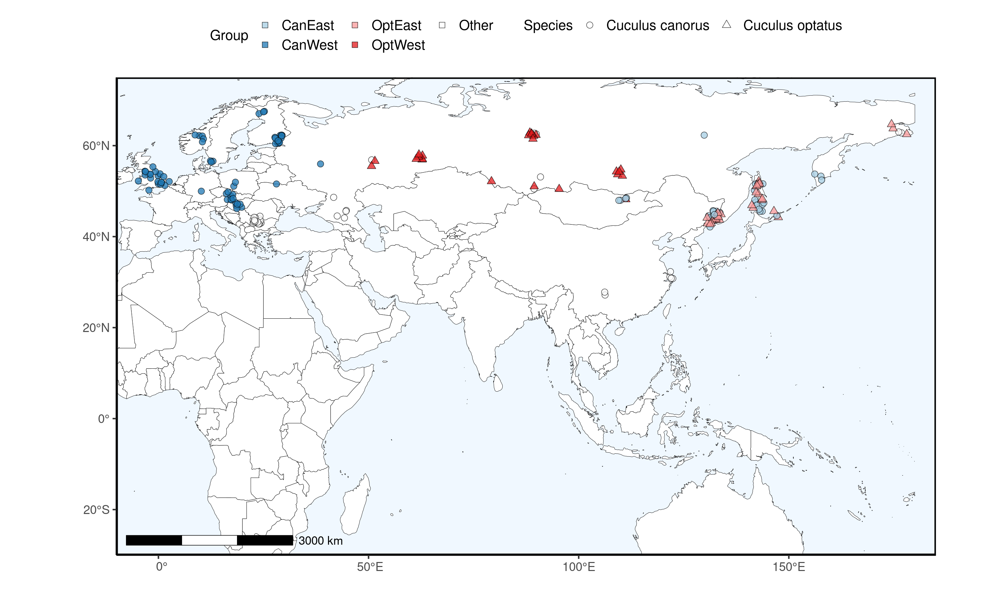
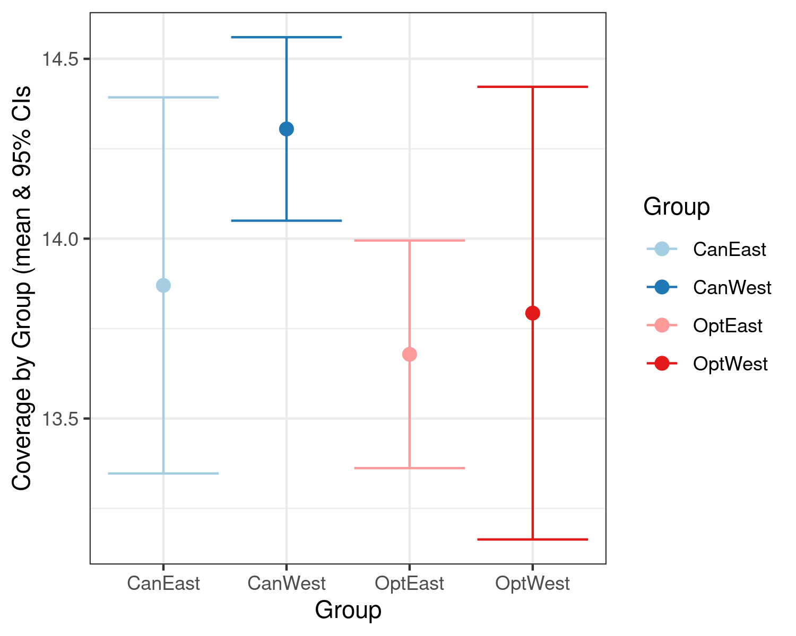

# Subsampling n=20 per group 

For sensitivity, assess subsampling n=20 instead of n=10 for each group - N = 80 total. Find R script.  

Sampling distribution:

Mean and 95% CI WGS coverage for each group: 

The subsetting scripts `7C.Subsample_Demography_N80Subset.sh` and `8C.Merge_Autosomes_N80.sh` mirror the subsetting scripts found in `/snp_calling/branch_folded/` which subset the n=10. 

The files in general are found: `/dss/dsslegfs01/pr53da/pr53da-dss-0021/projects/2023__MigratoryGenomics/analyses/subsampled_n80_vcfs` 

Path to SNPs file - folded (N = 38,113,340 SNPs; very similar to the n = 40 38,326,508 SNPs): 
`/dss/dsslegfs01/pr53da/pr53da-dss-0021/projects/2023__MigratoryGenomics/analyses/subsampled_n80_vcfs/merged/Autosomes_Folded_snpsN80.MQ-5X-MM1-Neutral-NonRepetitive.vcf.gz`

Path to invariant sites file - folded (N = 716,096,829 SNPs):  
`/dss/dsslegfs01/pr53da/pr53da-dss-0021/projects/2023__MigratoryGenomics/analyses/subsampled_n80_vcfs/merged/Autosomes_invariantN80.MQ-5X-MM1-Neutral-NonRepetitive.vcf.gz`
