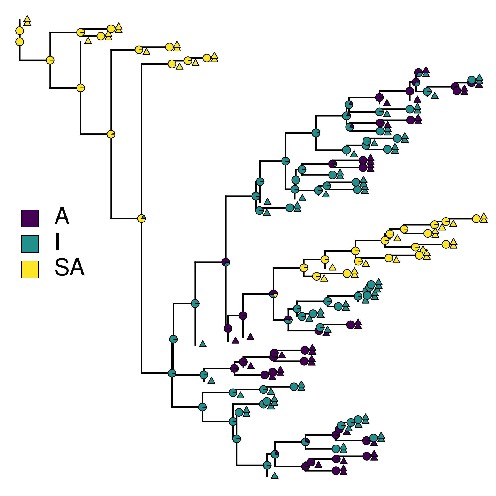
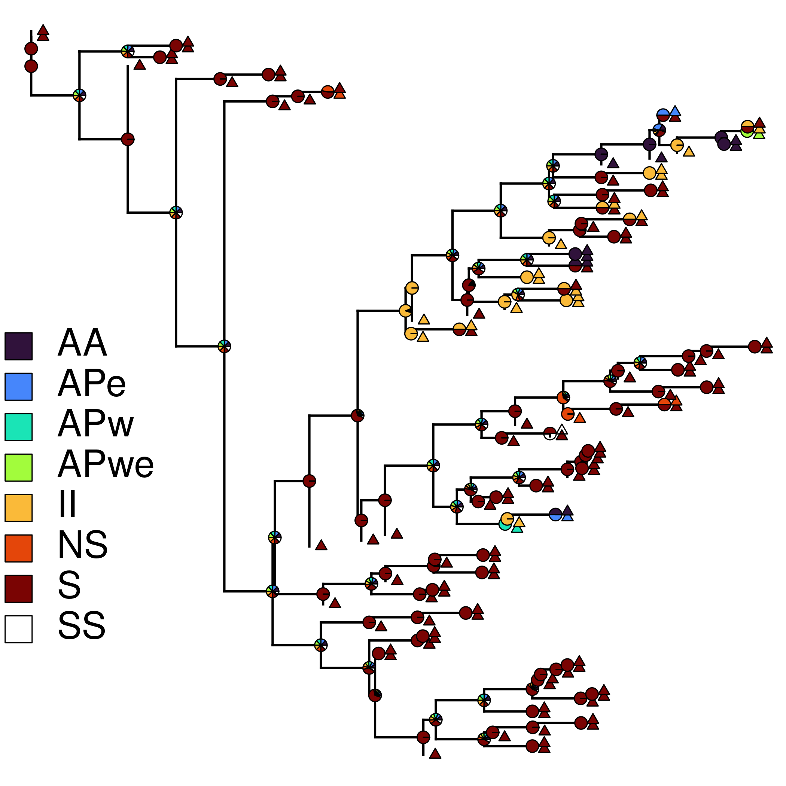

# Ancestral reconstruction of overwintering (or residency) and route

Using Hackett Sequenced Species: 10K trees with 6670 OTUs [5k sampled] from [Birdtree](https://birdtree.org/subsets)

Birds were assigned overwintering location and route based on birds of the world, with this labeling scheme:

| Route | Nonbreeding | Description                                      |
| ----- | ----------- | ------------------------------------------------ |
| S     | I           | Sedentary within Indo-Malay / Australia          |
| S     | SA          | Sedentary within the Americas                    |
| S     | A           | Sedentary within Africa                          |
| II    | I           | Migration within Indo-Malay / Australia          |
| SS    | SA          | Migration within South America                   |
| AA    | A           | Migration within Africa                          |
| APw   | A           | Africa - Palearctic migration, western route     |
| APe   | A           | Africa - Palearctic migration, eastern route     |
| APwe  | A           | Africa - Palearctic migration, polymorphic route |
| NS    | SA          | North - South America migration                  |

## Estimate Species Tree `01_EstimateSpeciesTree.sh` 

## Estimate ancestral states `02_Reconstruction.R` 

Using equal rates deterministic approach. 

For residency, including tip points:

 

And for route:

