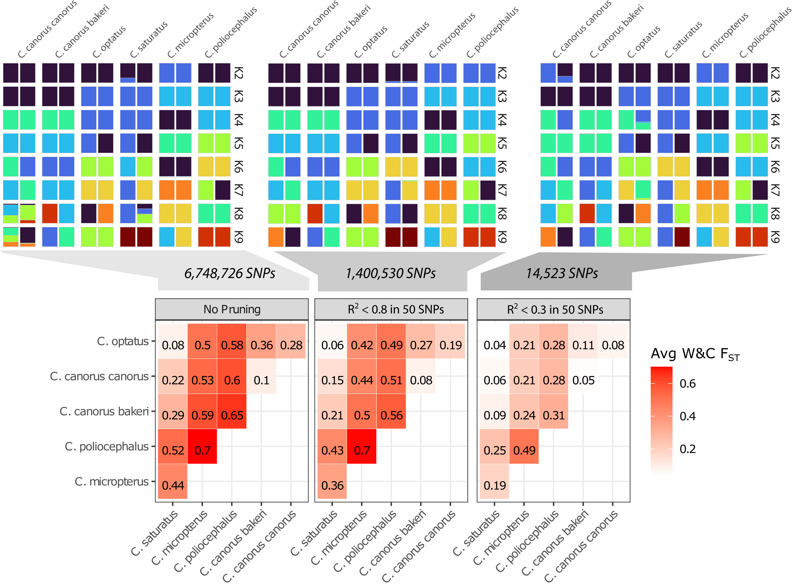

# Species distinctions

Using subset n=2 from each species and subspecies, run ADMIXTURE and calculate FST. Since LD will necessarily bias results, but ADMIXTURE requires LD pruning, I will run 3 iterations: 1) unpruned, 2) weak pruning (R2 > 0.8 in 50 SNPs) and 3) pruning (2 > 0.3 in 50 SNPs). 

LD pruning has strong effects, but for both unpruned and weakly pruned datasets we recover the expected patterns. K = 5 is the most supported based on evalAdmix. Interestngly, only with weakly pruned data at K = 8 do we see the c. c. canorus and c. c. bakeri divide, which mirrors the east west divide. 

